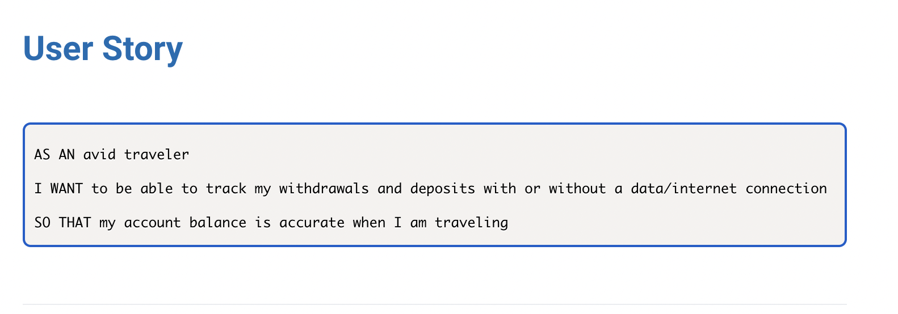
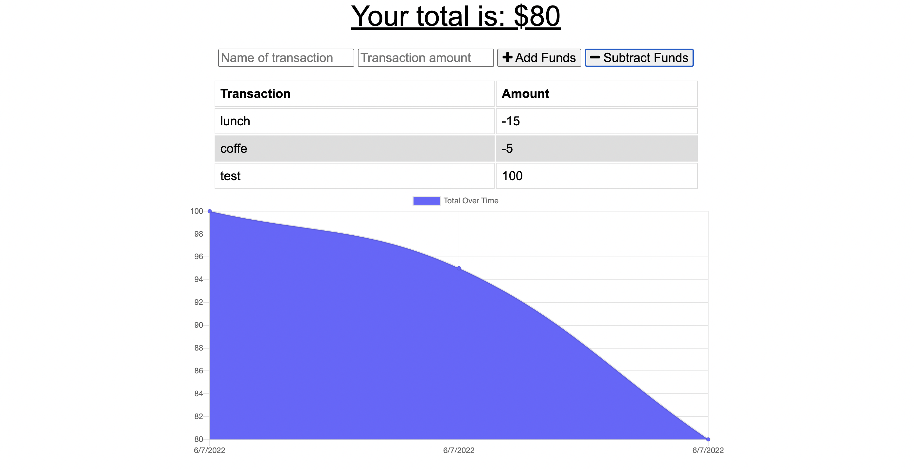

# budget-tracker

## Description
Budget tracker is an application that allows users to access their bank information  with offline functionality. The user will be able to add expenses and deposits to their budget with or without a connection. If the user enters transactions offline, the total should be updated when they're brought back online. 

## User story 

## Usage 
* This application will allow users to:
    - Add negative funds
    - Add positive funds
    - See a graph of expenses
    - Able to use it offline

## Website

## Technologies Used

<a href="https://www.npmjs.com/package/express">Express</a>

<a href="https://www.npmjs.com/package/mongoose">Mongoose</a>

<a href="npmjs.com/package/webpack">Webpack</a>

## Live link

<a href="https://still-reef-41611.herokuapp.com/"> Website </a>
